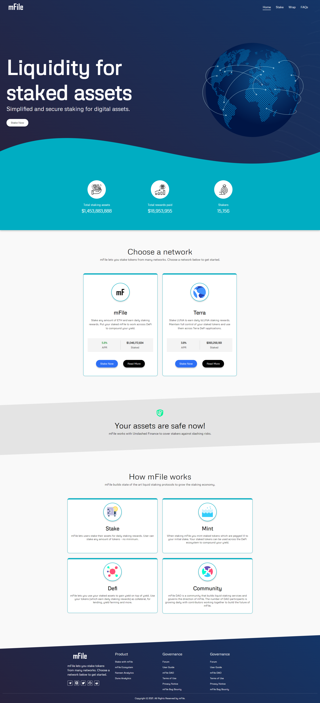

# mFile
A simple frontend application built using HTML, CSS, Bootstrap, JavaScript and jQuery.

## Getting Started
These instructions will get you a copy of the project up and running on your 
local machine for development and testing purposes.

## Prerequisites
A modern web browser (e.g. Google Chrome, Mozilla Firefox, etc.)

## Installation
    * Clone or download the repository to your local machine.
    * Open the index.html file in your browser.

## Built With
    * HTML
    * CSS
    * Bootstrap
    * JavaScript
    * jQuery

## Result

